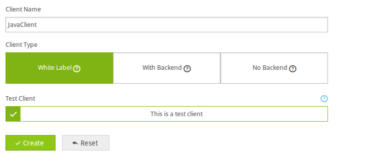
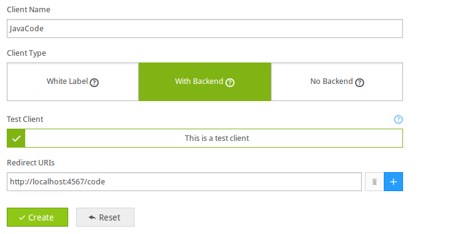

Playlyfe Java SDK [](http://search.maven.org/#artifactdetails|com.playlyfe|playlyfe-java-sdk|0.2.0|jar)
=================

This is the official OAuth 2.0 Java client SDK for the Playlyfe API.
It supports the `client_credentials` and `authorization code` OAuth 2.0 flows.
For a complete API Reference checkout [Playlyfe Developers](https://dev.playlyfe.com/docs/api.html) for more information.

> Note: Breaking Changes this is the new version of the sdk which uses the Playlyfe api v2 by default if you still want to use the v1 api you can do that so by passing a version key in the options when creating a client with 'v1' as the value

ex:
```java
playlyfe = new Playlyfe("Your client id", "Your client secret", null, "v1");
```


Requires
--------
Java >= 1.6

Install
----------
if you are using gradle then
```java
compile "com.playlyfe:sdk:0.2.0"
```
or if you prefer to use maven
```xml
<dependency>
    <groupId>com.playlyfe</groupId>
    <artifactId>playlyfe-java-sdk</artifactId>
    <version>0.2.0</version>
</dependency>
```
# Using
### Create a client
  If you haven't created a client for your game yet just head over to [Playlyfe](http://playlyfe.com) and login into your account, and go to the game settings and click on client

  **1.Client Credentials Flow**
    In the client page click on whitelabel client
    

  **2.Authorization Code Flow**
    In the client page click on backend client and specify the redirect uri this will be the url where you will be redirected to get the token
    

> Note: If you want to test the sdk in staging you can click the Test Client button.

  And then note down the client id and client secret you will need it later for using it in the sdk

# Examples
The Playlyfe class allows you to make rest api calls like GET, POST, .. etc.  
To get started create a new playlyfe object using client credentials flow and then start making requests
**For api v1**
```java
try {
    Playlyfe playlyfe = new Playlyfe("Your client id", "Your client secret", null, "v1");
} catch (ClientProtocolException e) {
    e.printStackTrace();
} catch (IOException e) {
    e.printStackTrace();
} catch (IllegalStateException e) {
    e.printStackTrace();
} catch (URISyntaxException e) {
    e.printStackTrace();
} catch (PlaylyfeException e) {
    e.printStackTrace();
}

HashMap<String, String> player_id = new HashMap<String, String>();
player_id.put("player_id", "student1");
// To get infomation of a  player
Map<String, Object> player = (Map<String, Object>)playlyfe.get("/player", player_id);
System.out.println(student1.get("id"));
System.out.println(student1.get("alias"));

// To get all available processes
Object processes = playlyfe.get("/processes", player_id);
System.out.println(processes);
// To start a process
HashMap<String, String> body = new HashMap<String, String>();
body.put("name", "patched_process");
process =  playlyfe.post("/definitions/processes/collect",player_id, body);

//To play a process
HashMap<String, String> body = new HashMap<String, String>();
body.put("trigger", "collect");
playlyfe.post("/processes/"+process_id+"/play", player_id, body);

// A PLaylyfeException is thrown when an error from the playlyfe platform is returned on a request
try {
  playlyfe.get("/unkown", null);
}
catch(PlaylyfeException err) {
  System.out.println (err.getName()); // route_not_found
  System.out.println (err.getMessage()); // This route does not exist
}
```
**For api v2**
```java
try {
    Playlyfe playlyfe = new Playlyfe("Your client id", "Your client secret", null);
} catch (ClientProtocolException e) {
    e.printStackTrace();
} catch (IOException e) {
    e.printStackTrace();
} catch (IllegalStateException e) {
    e.printStackTrace();
} catch (URISyntaxException e) {
    e.printStackTrace();
} catch (PlaylyfeException e) {
    e.printStackTrace();
}

HashMap<String, String> player_id = new HashMap<String, String>();
player_id.put("player_id", "student1");
// To get infomation of a  player
Map<String, Object> player = (Map<String, Object>)playlyfe.get("/runtime/player", player_id);
System.out.println(student1.get("id"));
System.out.println(student1.get("alias"));

// To get all available processes
Object processes = playlyfe.get("/runtime/processes", player_id);
System.out.println(processes);
// To start a process
HashMap<String, String> body = new HashMap<String, String>();
body.put("name", "patched_process");
body.put("definition", "collect");
process =  playlyfe.post("/runtime/processes/",player_id, body);

//To play a process
HashMap<String, String> body = new HashMap<String, String>();
body.put("trigger", "collect");
playlyfe.post("/runtime/processes/"+process_id+"/play", player_id, body);

// A PLaylyfeException is thrown when an error from the playlyfe platform is returned on a request
try {
  playlyfe.get("/unknown", null);
}
catch(PlaylyfeException err) {
  System.out.println (err.getName()); // route_not_found
  System.out.println (err.getMessage()); // This route does not exist
}
```
# Documentation
You can initiate a client by giving the client_id and client_secret params
###1. Client Credentials Flow
```java
import com.playlyfe.sdk.Playlyfe;

Playlyfe playlyfe = new Playlyfe("Your client id", "Your client secret", null)
```
###2. Authorization Code Flow
```java
import com.playlyfe.sdk.Playlyfe;

Playlyfe playlyfe = new Playlyfe("Your client id", "Your client secret", "Your redirect URI", null)
```
In development the sdk caches the access token in memory so you don"t need to provide the persist access token object. But in production it is highly recommended to persist the token to a database. It is very simple and easy to do it with redis. You can see the test cases for more examples.
```java
    import com.playlyfe.sdk.Playlyfe;
    import com.playlyfe.sdk.PersistAccessToken;

    Playlyfe("Your client id", "Your client secret", new PersistAccessToken(){

        // This will persist the access token to a database. You have to persist the token to a database if you want the access token to remain the same in every request
        @Override
        public void store(Map<String, Object> token) {
            System.out.println("Storing Access Token");
        }

        // This will load the access token. This is called internally by the sdk on every request so that the access token can be persisted between requests
        @Override
        public Map<String, Object> load() {
            return token;
        }

    });
```

**API**
```java
Object api("GET", // The request method can be GET/POST/PUT/PATCH/DELETE
    "", // The api route to get data from
    HashMap<string, string>, // The query params that you want to send to the route
    Object or HashMap<string, string> ,// The data you want to post to the api
    false // Whether you want the response to be in raw string form or json
)
```

**Get**
```java
Object get("", // The api route to get data from
    HashMap<string, string>, // The query params that you want to send to the
    false // Whether you want the response to be in raw string form or json
)
```
**Post**
```java
Object post("", // The api route to post data to
    HashMap<string, string>, // The query params that you want to send to the route
    Object or HashMap<string, string> // The data you want to post to the api this will be automagically converted to json
)
```
**Patch**
```java
Object patch(
    route: "" // The api route to patch data
    query: HashMap<string, string> // The query params that you want to send to the route
    Object or HashMap<string, string> // The data you want to update in the api this will be automagically converted to json
)
```
**Put**
```java
Object put("" // The api route to put data
    HashMap<string, string>, // The query params that you want to send to the route
    Object or HashMap<string, string> // The data you want to update in the api this will be automagically converted to json
)
```
**Delete**
```java
Object delete("" // The api route to delete the component
    HashMap<string, string> // The query params that you want to send to the route
)
```
**Get Login Url**
```java
String get_login_url()
//This will return the url to which the user needs to be redirected for the user to login.
```

**Exchange Code**
```java
void exchange_code(String code)
//This is used in the auth code flow so that the sdk can get the access token.
//Before any request to the playlyfe api is made this has to be called atleast once.
//This should be called in the the route/controller which you specified in your redirect_uri
```

**Errors**  
A ```PlaylyfeException``` is thrown whenever an error occurs in each call.The Error contains a name and message field which can be used to determine the type of error that occurred.

License
=======
Playlyfe Java SDK v0.2.0  
http://dev.playlyfe.com/  
Copyright(c) 2013-2014, Playlyfe IT Solutions Pvt. Ltd, support@playlyfe.com

Permission is hereby granted, free of charge, to any person obtaining a copy
of this software and associated documentation files (the "Software"), to deal
in the Software without restriction, including without limitation the rights
to use, copy, modify, merge, publish, distribute, sublicense, and/or sell
copies of the Software, and to permit persons to whom the Software is
furnished to do so, subject to the following conditions:

The above copyright notice and this permission notice shall be included in
all copies or substantial portions of the Software.

THE SOFTWARE IS PROVIDED "AS IS", WITHOUT WARRANTY OF ANY KIND, EXPRESS OR
IMPLIED, INCLUDING BUT NOT LIMITED TO THE WARRANTIES OF MERCHANTABILITY,
FITNESS FOR A PARTICULAR PURPOSE AND NONINFRINGEMENT. IN NO EVENT SHALL THE
AUTHORS OR COPYRIGHT HOLDERS BE LIABLE FOR ANY CLAIM, DAMAGES OR OTHER
LIABILITY, WHETHER IN AN ACTION OF CONTRACT, TORT OR OTHERWISE, ARISING FROM,
OUT OF OR IN CONNECTION WITH THE SOFTWARE OR THE USE OR OTHER DEALINGS IN
THE SOFTWARE.
